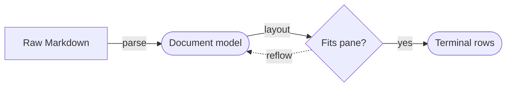

# Terminal document preview

This file exercises Luvus's explicit Markdown preview without changing the
configured behavior for opening source files.

## Inline formatting

Markdown preview supports **strong text**, *emphasis*, ~~strikethrough~~,
`inline code`, and [a relative file link](workflow.mmd).

> Preview rendering is terminal-native, offline, and derived from the raw file.

### Review checklist

- [x] Open this file with **Open Markdown Preview**.
- [x] Search rendered text with `/`, then move with `n` and `N`.
- [ ] Compare the rendered document at narrow and wide pane widths.
- Open `workflow.mmd` normally or through **Open Mermaid Preview**.

| Input | Preview behavior |
|---|---|
| `.md` / `.markdown` | Styled Markdown document |
| Mermaid fence | Unicode terminal diagram |
| Raw HTML | Safe text; never executed |

```rust
fn preview_is_explicit() -> bool {
    true
}
```



---

The raw source remains available through the normal file-opening behavior.
